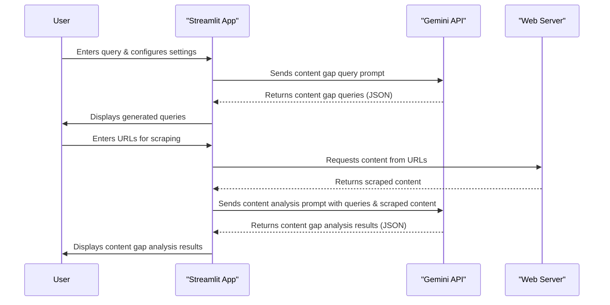

# Query Fan-Out Simulator & Content Analysis

This repository contains code for simulating query fan‑out and performing content analysis, particularly for content‑gap identification. It uses Streamlit for the user interface, Google's Gemini API for query generation and content analysis, and Beautiful Soup for web scraping. The application allows users to input a query and, using the Gemini API, generates a set of related queries for content‑gap analysis. It then scrapes content from specified URLs and analyzes it against the generated queries to identify content gaps and optimization opportunities.

---

## Key Features

- **Query Generation:** Uses Gemini API to generate related queries for content‑gap analysis.  
- **Web Scraping:** Scrapes content from URLs provided by the user.  
- **Content Analysis:** Analyzes scraped content against generated queries to identify gaps.  
- **Streamlit UI:** Provides an interactive user interface for configuration and analysis.  

---

## Quick Start

### 1. Clone & install

```bash
git clone https://github.com/naveen3830/query-fan-out.git
cd query-fan-out
pip install -r requirements.txt
```

### 2. Add your Gemini API key

```bash
export GEMINI_API_KEY="your-key-here"
```

*(On Windows PowerShell you can use `setx GEMINI_API_KEY "your-key-here"`.)*

### 3. Launch

```bash
streamlit run app.py
```

Your browser will open at [http://localhost:8501](http://localhost:8501).

---

## Usage Walk‑Through

| Step | What you do                                      | What the app does                                                            |
| ---- | ------------------------------------------------ | ---------------------------------------------------------------------------- |
| 1    | Enter a seed query (e.g., *What is Quantum Key Distribution*) | Gemini returns 20–50 related queries                                         |
| 2    | Paste competitor URLs or your own                | Scrapes headings, body text, meta tags                                       |
| 3    | Click **Analyze**                                | Gemini scores each query for coverage and surfaces gaps plus recommendations |

---

## Data Flow



---

## Stack

* **Frontend:** Streamlit
* **LLM:** Google Gemini (`google‑generativeai`)
* **Scraper:** BeautifulSoup + Requests
* **Extras:**
  * Pydantic for schema validation
  * python‑dotenv for environment variable management

---

## Configuration

| .env variable     | Purpose                         | Default      |
| ----------------- | ------------------------------- | ------------ |
| `GEMINI_API_KEY`  | Google AI access key            | *(required)* |
| `MAX_QUERIES`     | Max related queries to generate | 30           |
| `MAX_URLS`        | Max URLs to scrape              | 10           |
| `REQUEST_TIMEOUT` | HTTP request timeout (s)        | 15           |

Create a `.env` file in the project root or export variables in your shell.

---

## Project Directory Structure

```
query-fan-out/
├── app.py
├── reddit_scrapper.py
├── requirements.txt
├── uv.lock
├── pyproject.toml
├── .gitignore
├── .python-version
├── README.md
├── .streamlit/
    └── config.toml

```
